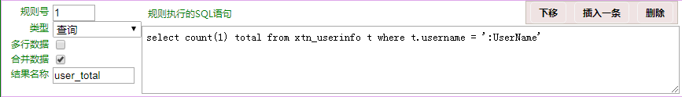
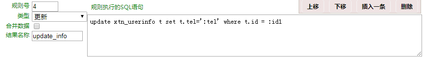
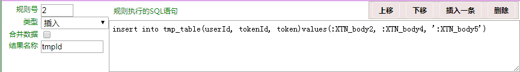
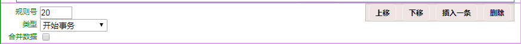
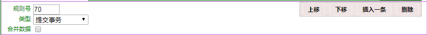
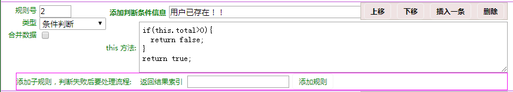
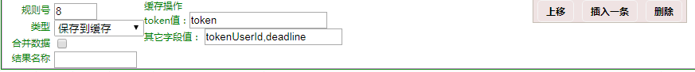
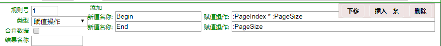
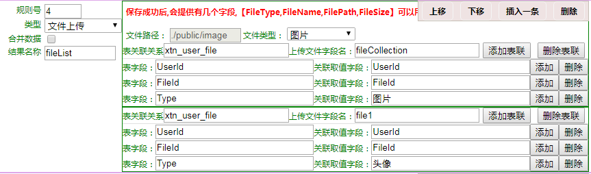
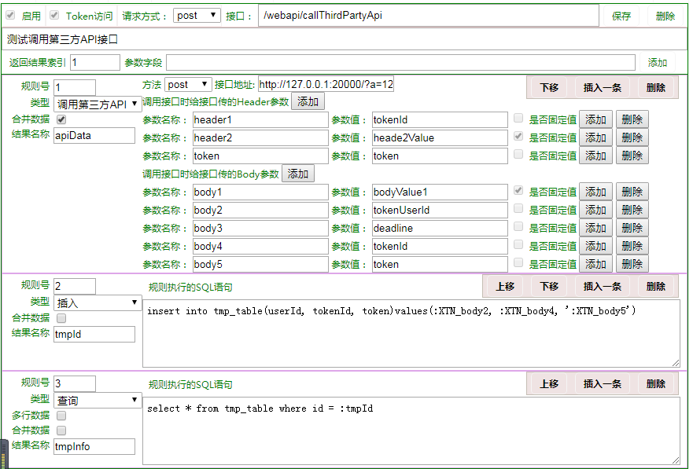

# TravelTogether

## ！！注意！！
由于用的是http2请求，证书是在一个网站 https://csr.chinassl.net/index.html 里申请的。因此，如果用IE进行调试的话，后台NodeJs服务器会报异常,google浏览器没有发现问题。所有写的prototype.的方法在IE10下找不到，服务器就报异常了；
``` code
http.ServerResponse.prototype.Send = function (data) {
  this.write(JSON.stringify(data));
  this.end();
};

--
其实他地方调用的方法时如： Response.Send({}); IE10来的请求就报说找不到 Send()这个方法，google浏览器就可以正常使用。
```

## 如果数据库连接数量超过最大值，可以修改ManagerQueue.js  Next()方法里 setTimeout，添加点时间来进行缓冲一下。


## 批量文件上传时个数据表文件为：
``` sql
CREATE TABLE `xtn_sys_file` (
  `FileId` int(11) NOT NULL AUTO_INCREMENT,
  `FileType` varchar(50) DEFAULT NULL COMMENT '文件类型',
  `FileName` varchar(150) DEFAULT NULL COMMENT '文件名称',
  `FilePath` varchar(200) DEFAULT NULL COMMENT '文件路径',
  `FileSize` int(11) DEFAULT NULL COMMENT '文件大小',
  `Status` tinyint(1) DEFAULT '1',
  `CreateTime` datetime DEFAULT CURRENT_TIMESTAMP COMMENT '创建时间',
  PRIMARY KEY (`Id`)
) ENGINE=InnoDB AUTO_INCREMENT=24 DEFAULT CHARSET=utf8 COMMENT='文件系统表';

```
- 文件上传成功后返回，上传成功的ID

# 后台接口配置系统
## 已经完成的功能
- 查询

- 更新

- 插入

- 删除

- 开始事务

- 提交事务

- 条件判断

- 保存到缓存

- 赋值操作

- 主子关系
- 验证码
- 文件上传

- 调用第三方API,配置如下。

-----


项目的依赖安装
```bash
npm install
```
项目启动
```bash
npm run dev
```
单独启动前端的话
```
npm run start
```
单独启动后台接口
```bash
npm run start-dev
```

如果专门调试接口的话，还是分别单独启动为好.

## nodejs.sql MySql 5.7以上版本。
由于本试例中要用到MYSQL数据，所在在项目的根目录中有一个nodejs.sql的文件。将结构导入到数据库中即可，数据库版本是5.7以的，因为里面有一个sys_rule表里的Content存放的是JSON,只有5.7才能支持JSON字段。
 
 ## 修改数据库连接
 /server/ctrl_es6/DbHelper.js里33行左右
 ```javascript
 /**
   * 创建一个资源池
   * 
   * @memberof MySqlHelper
   */
  __CreatePool() {
    this.pool = mysql.createPool({
      connectionLimit: 10,
      host: 'localhost', // 数据库连接
      user: 'liaohb',    // 数据库名用户名
      password: 'xiaotuni', // 密码
      database: 'nodejs'   // 表空间
    });

    this.pool.on('connection', (connection)=> {
      // connection.query('SET SESSION auto_increment_increment=1')
    });
    this.pool.on('release', (connection)=> {
      // console.log('Connection %d released', connection.threadId);
    });
  }

 ```
 
 # 组件
 ------
 ## Scroll.ts有个问题
 
 ```
    const __ctrl = document.body.children[0].children[1];
    const { scrollTop, scrollHeight } = __ctrl;
 ```
- 在SlideNextPage() 方法里，上面这行代码，为什么这样写，页不写成 document.body呢？是因为，我在做路由界面切换动画时，设置了position: 'fixed' ,如果这种切换动画话，就可以改成 
```
 const { scrollTop, scrollHeight } = document.body;
```


This project was generated with [Angular CLI](https://github.com/angular/angular-cli) version 1.0.3.

## Development server

Run `ng serve` for a dev server. Navigate to `http://localhost:4200/`. The app will automatically reload if you change any of the source files.

## Code scaffolding

Run `ng generate component component-name` to generate a new component. You can also use `ng generate directive|pipe|service|class|module`.

## Build

Run `ng build` to build the project. The build artifacts will be stored in the `dist/` directory. Use the `-prod` flag for a production build.

## Running unit tests

Run `ng test` to execute the unit tests via [Karma](https://karma-runner.github.io).

## Running end-to-end tests

Run `ng e2e` to execute the end-to-end tests via [Protractor](http://www.protractortest.org/).
Before running the tests make sure you are serving the app via `ng serve`.

## Further help

To get more help on the Angular CLI use `ng help` or go check out the [Angular CLI README](https://github.com/angular/angular-cli/blob/master/README.md).
